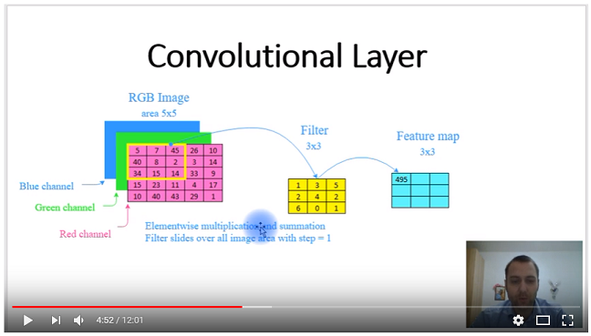

# Neural Networks for Computer Vision
Implementing Neural Networks for Computer Vision in autonomous vehicles and robotics for classification, pattern recognition, control. From very beginning to complex project.
 

### Reference to:
Valentyn N Sichkar. Neural Networks for computer vision in autonomous vehicles and robotics // GitHub platform. DOI: 10.5281/zenodo.1317904

### Structure of repository
* <a href="#Related works">Related works</a>
* <a href="#Description">Description</a>
* <a href="#Content">Content</a>
  * <a href="#Codes">Codes</a>
  * <a href="#Theory and experimental results">Theory and experimental results</a>

 

### 
Related works:

* Sichkar V.N. Comparison analysis of knowledge based systems for navigation of mobile robot and collision avoidance with obstacles in unknown environment. St. Petersburg State Polytechnical University Journal. Computer Science. Telecommunications and Control Systems, 2018, Vol. 11, No. 2, Pp. 64–73. DOI: <a href="https://doi.org/10.18721/JCSTCS.11206" target="_blank">10.18721/JCSTCS.11206</a> (Full-text available also here https://www.researchgate.net/profile/Valentyn_Sichkar)

* The study on image processing in Python is put in separate repository and is available here: https://github.com/sichkar-valentyn/Image_processing_in_Python

* The study of Semantic Web languages OWL and RDF for Knowledge representation of Alarm-Warning System is put in separate repository and is available here: https://github.com/sichkar-valentyn/Knowledge_Base_Represented_by_Semantic_Web_Language

* The research results for Neural Network Knowledge Based system for the tasks of collision avoidance is put in separate repository and is available here: https://github.com/sichkar-valentyn/Matlab_implementation_of_Neural_Networks

* The research on Machine Learning algorithms and techniques in Python is put in separate repository and is available here: https://github.com/sichkar-valentyn/Machine_Learning_in_Python

 

### <a name="Description">Description</a>
The aim of the repository is to study and create complex project on Computer vision in autonomous vehicles and robotics through basics in Neural Networks to advanced learning. Here is brief description of repository, its stages of development, animated figures with empirical results. To get full content scroll down or click <a href="#Content">here</a>. **This repository is currently under construction, coming soon, will be released in December 2018.**

* **Example #1** - simple convolving of input image with three different filters for **edge detection**.
 

 

* **Example #2** - more complex convolving of input image with following architecture:
 `Input` --> `Conv --> ReLU --> Pool` --> `Conv --> ReLU --> Pool` --> `Conv --> ReLU --> Pool`

  ReLU --> Pool">

 

* **Example #3** - video introduction into Convolutional NN with Python from scratch:
 

 

### <a name="Content">Content</a>
**<a name="Codes">Codes</a>** (it'll send you to appropriate file):
* Introduction part:
  * [Intro_simple_NN.py](https://github.com/sichkar-valentyn/Neural_Networks_for_Computer_Vision/blob/master/Codes/Intro_simple_NN.py)
  * [Intro_simple_three_layers_NN.py](https://github.com/sichkar-valentyn/Neural_Networks_for_Computer_Vision/blob/master/Codes/Intro_simple_three_layers_NN.py)
* Convolutional Neural Networks in Python with `numpy` only:
  * [CNN_Simple_Convolution.py](https://github.com/sichkar-valentyn/Neural_Networks_for_Computer_Vision/blob/master/Codes/CNN_Simple_Convolution.py)
  * [CNN_More_complex_example.py](https://github.com/sichkar-valentyn/Neural_Networks_for_Computer_Vision/blob/master/Codes/CNN_More_complex_example.py)  
* CIFAR-10 Image Classification with `numpy` only:
  * `Data_Preprocessing`
    * `datasets`
      * [get_CIFAR-10.sh](https://github.com/sichkar-valentyn/Neural_Networks_for_Computer_Vision/blob/master/Codes/Image_Classification/Data_Preprocessing/datasets/get_CIFAR-10.sh)
    * [datasets_preparing.py](https://github.com/sichkar-valentyn/Neural_Networks_for_Computer_Vision/blob/master/Codes/Image_Classification/Data_Preprocessing/datasets_preparing.py)
    * [mean_and_std.pickle](https://github.com/sichkar-valentyn/Neural_Networks_for_Computer_Vision/blob/master/Codes/Image_Classification/Data_Preprocessing/mean_and_std.pickle)    
  * `Helper_Functions`
    * [layers.py](https://github.com/sichkar-valentyn/Neural_Networks_for_Computer_Vision/blob/master/Codes/Image_Classification/Helper_Functions/layers.py)
    * optimize_rules.py
  * `Classifiers`
    * [ConvNet1.py](https://github.com/sichkar-valentyn/Neural_Networks_for_Computer_Vision/blob/master/Codes/Image_Classification/Classifiers/ConvNet1.py) 
  * `Serialized_Models`
    * model1.pickle
  * Solver.py

 

**<a name="Theory and experimental results">Theory and experimental results</a>** (it'll send you to appropriate page):
* [Introduction into Neural Networks](https://github.com/sichkar-valentyn/Neural_Networks_for_Computer_Vision/blob/master/Theory/Introduction.md)
  * [Gradient descent](https://github.com/sichkar-valentyn/Neural_Networks_for_Computer_Vision/blob/master/Theory/Gradient_descent.md)
  * [Backpropagation](https://github.com/sichkar-valentyn/Neural_Networks_for_Computer_Vision/blob/master/Theory/Backpropagation.md)
* [Convolutional Neural Networks](https://github.com/sichkar-valentyn/Neural_Networks_for_Computer_Vision/blob/master/Theory/Convolutional_Neural_Network.md)
* [OpenCV](https://github.com/sichkar-valentyn/Neural_Networks_for_Computer_Vision/blob/master/Theory/OpenCV.md)
* [Tensorflow](https://github.com/sichkar-valentyn/Neural_Networks_for_Computer_Vision/blob/master/Theory/Tensorflow.md)

 

### MIT License
### Copyright (c) 2018 Valentyn N Sichkar
### github.com/sichkar-valentyn
### Reference to:
Valentyn N Sichkar. Neural Networks for computer vision in autonomous vehicles and robotics // GitHub platform. DOI: 10.5281/zenodo.1317904
