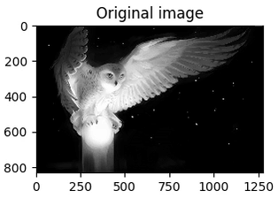

# Neural Networks for Computer Vision
Implementing Neural Networks for Computer Vision in Autonomous Vehicles and Robotics, for Object Detection and Object Tracking, Object Classification, Pattern Recognition, Robotics Control. From Very Beginning to Complex and Huge Project.
 

### Reference to:
Valentyn N Sichkar. Neural Networks for computer vision in autonomous vehicles and robotics // GitHub platform. DOI: 10.5281/zenodo.1317904

### Structure of repository
* [Research papers](#research-papers)
* [Related works](#related-works)
* [Description](#description)
* [Empirical Examples](#empirical-examples)
* [Content](#content)
  * [Theory and experimental results](#theory-and-experimental-results)
  * [Codes](#codes)

 

### <a id="research-papers">Research papers</a>
* Sichkar V. N. "Reinforcement Learning Algorithms in Global Path Planning for Mobile Robot", 2019 International Conference on Industrial Engineering, Applications and Manufacturing (ICIEAM), Sochi, Russia, 2019, pp. 1-5. doi: <a href="https://doi.org/10.1109/ICIEAM.2019.8742915" target="_blank">10.1109/ICIEAM.2019.8742915</a> (Full-text available also here <a href="https://www.researchgate.net/profile/Valentyn_Sichkar" target="_blank">ResearchGate.net/profile/Valentyn_Sichkar</a>)

* Sichkar V. N. Effect of various dimension convolutional layer filters on traffic sign classification accuracy. Scientific and Technical Journal of Information Technologies, Mechanics and Optics, 2019, vol. 19, no. 3, pp. DOI: <a href="https://doi.org/10.17586/2226-1494-2019-19-3-546-552" target="_blank">10.17586/2226-1494-2019-19-3-546-552</a> (Full-text available also here https://www.researchgate.net/profile/Valentyn_Sichkar)

* Sichkar V.N. Comparison analysis of knowledge based systems for navigation of mobile robot and collision avoidance with obstacles in unknown environment. St. Petersburg State Polytechnical University Journal. Computer Science. Telecommunications and Control Systems, 2018, Vol. 11, No. 2, Pp. 64–73. DOI: <a href="https://doi.org/10.18721/JCSTCS.11206" target="_blank">10.18721/JCSTCS.11206</a> (Full-text available also here https://www.researchgate.net/profile/Valentyn_Sichkar)

 

### <a id="related-works">Related works</a>
* The study on image processing in Python is put in separate repository and is available here: https://github.com/sichkar-valentyn/Image_processing_in_Python

* The study of Semantic Web languages OWL and RDF for Knowledge representation of Alarm-Warning System is put in separate repository and is available here: https://github.com/sichkar-valentyn/Knowledge_Base_Represented_by_Semantic_Web_Language

* The research results for Neural Network Knowledge Based system for the tasks of collision avoidance is put in separate repository and is available here: https://github.com/sichkar-valentyn/Matlab_implementation_of_Neural_Networks

* The research on Machine Learning Algorithms and techniques in Python is put in separate repository and is available here: https://github.com/sichkar-valentyn/Machine_Learning_in_Python

 

### <a id="description">Description</a>
The **main aim** of the repository is to study and to develope complex project on Computer Vision in autonomous vehicles and robotics through basics in Neural Networks to advanced learning. Here is brief description of repository, its stages of development, animated figures with empirical results. To get full content scroll down or click [here](#content) to reach the content.

 

### <a id="empirical-examples">Empirical Examples</a>
* **Example #1** - simple convolving of input image with three different filters for **edge detection**.
 

 

* **Example #2** - more complex Convolving of input image with following architecture:
 `Input` ---> `Conv --> ReLU --> Pool` ---> `Conv --> ReLU --> Pool` ---> `Conv --> ReLU --> Pool`

  ReLU --> Pool">

 

* :mortar_board: Related Course for Detection Tasks. **Training YOLO v3 for Objects Detection with Custom Data.** *Build your own detector by labelling, training and testing on image, video and in real time with camera.* Join here: [https://www.udemy.com/course/training-yolo-v3-for-objects-detection-with-custom-data/](https://www.udemy.com/course/training-yolo-v3-for-objects-detection-with-custom-data/?referralCode=A283956A57327E37DDAD)

:triangular_flag_on_post: Concept Map of the Course

:point_right: Join the Course
[https://www.udemy.com/course/training-yolo-v3-for-objects-detection-with-custom-data/](https://www.udemy.com/course/training-yolo-v3-for-objects-detection-with-custom-data/?referralCode=A283956A57327E37DDAD)

 

* **Example #4** - image Classification with CNN and CIFAR-10 datasets in pure `numpy`, algorithm and file structure:
 

 

* **Example #5** - training of Model #1 for CIFAR-10 Image Classification:
 

 

* **Example #6** - Initialized Filters and Trained Filters for ConvNet Layer for CIFAR-10 Image Classification task:
 

 

* **Example #7** - training of Model #1 for MNIST Digits Classification:
 

 

* **Example #8** - Initialized Filters and Trained Filters for ConvNet Layer for MNIST Digits Classification:
 

 

* **Example #9** - Histogram of 43 classes for training dataset with their number of examples for Traffic Signs Classification before and after Equalization by adding transformated images from original dataset:
 

 

* **Example #10** - Prepared and preprocessed data for Traffic Sign Classification (`RGB`, `Gray`, `Local Histogram Equalization`):
 

 

* **Example #11** - Implementing Traffic Sign Classification with Convolutional Neural Network.
    * **Left:** Original frame with Detected Sign.
    * **Upper Right:** cut frame with Detected Sign.
    * **Lower Right:** classified frame by ConvNet according to the Detected Sign.
 

 

* **Example #12** - Enhancing image by CLAHE (Contrast Limited Adaptive Histogram Equalization) Algorithm for RGB images with OpenCV:
 

 

* **Example #13** - Accuracy for training CNN with different datasets for Traffic Sign Classification is shown on the figure below:
 

 

### <a id="content">Content</a>
### **<a id="theory-and-experimental-results">Theory and experimental results</a>** (it'll send you to appropriate page):
* [Introduction into Neural Networks](https://github.com/sichkar-valentyn/Neural_Networks_for_Computer_Vision/blob/master/Theory/Introduction.md)
  * [Gradient descent](https://github.com/sichkar-valentyn/Neural_Networks_for_Computer_Vision/blob/master/Theory/Gradient_descent.md)
  * [Backpropagation](https://github.com/sichkar-valentyn/Neural_Networks_for_Computer_Vision/blob/master/Theory/Backpropagation.md)
  * [Logistic Regression](https://github.com/sichkar-valentyn/Neural_Networks_for_Computer_Vision/blob/master/Theory/Logistic_Regression.md)

 

* [Convolutional Neural Networks](https://github.com/sichkar-valentyn/Neural_Networks_for_Computer_Vision/blob/master/Theory/Convolutional_Neural_Network.md)
  * [CIFAR-10 Image Classification with pure `numpy`](https://github.com/sichkar-valentyn/Neural_Networks_for_Computer_Vision/blob/master/Theory/cifar10.md)
  * [MNIST Image Classification with pure `numpy`](https://github.com/sichkar-valentyn/Neural_Networks_for_Computer_Vision/blob/master/Theory/mnist.md)
  * [Traffic Sign Classification](https://github.com/sichkar-valentyn/Neural_Networks_for_Computer_Vision/blob/master/Theory/traffic_sign.md)

 

* [Objects Detection](https://github.com/sichkar-valentyn/Neural_Networks_for_Computer_Vision/blob/master/Theory/Objects_Detection.md)
* [OpenCV](https://github.com/sichkar-valentyn/Neural_Networks_for_Computer_Vision/blob/master/Theory/OpenCV.md)
* [Tensorflow](https://github.com/sichkar-valentyn/Neural_Networks_for_Computer_Vision/blob/master/Theory/Tensorflow.md)

 

### **<a name="codes">Codes</a>** (it'll send you to appropriate file):
* Introduction part:
  * [Intro_simple_NN.py](https://github.com/sichkar-valentyn/Neural_Networks_for_Computer_Vision/blob/master/Codes/Intro_simple_NN.py)
  * [Intro_simple_three_layers_NN.py](https://github.com/sichkar-valentyn/Neural_Networks_for_Computer_Vision/blob/master/Codes/Intro_simple_three_layers_NN.py)
  * [Logistic_Regression.py](https://github.com/sichkar-valentyn/Neural_Networks_for_Computer_Vision/blob/master/Codes/Logistic_Regression/Logistic_Regression.py)
  * [Logistic_Regression.ipynb](https://github.com/sichkar-valentyn/Neural_Networks_for_Computer_Vision/blob/master/Codes/Logistic_Regression/Logistic_Regression.ipynb)

 

* Convolutional Neural Networks in Python with `numpy` only:
  * [CNN_Simple_Convolution.py](https://github.com/sichkar-valentyn/Neural_Networks_for_Computer_Vision/blob/master/Codes/CNN_Simple_Convolution.py)
  * [CNN_More_complex_example.py](https://github.com/sichkar-valentyn/Neural_Networks_for_Computer_Vision/blob/master/Codes/CNN_More_complex_example.py)  

 

### MIT License
### Copyright (c) 2018-2019 Valentyn N Sichkar
### github.com/sichkar-valentyn
### Reference to:
Valentyn N Sichkar. Neural Networks for computer vision in autonomous vehicles and robotics // GitHub platform. DOI: 10.5281/zenodo.1317904
